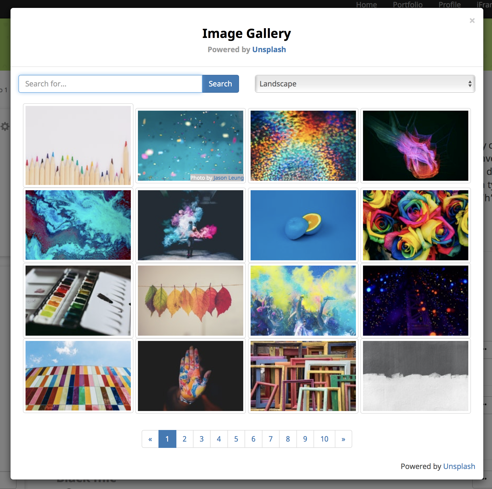

Yii2 Unsplash Extension
========================
This extension provides a Yii2 widget to display an image picker powered by Unsplash images API.

Installation
------------

The preferred way to install this extension is through [composer](http://getcomposer.org/download/).

Either run

```
php composer.phar require --prefer-dist cb-techservices/yii2-unsplash "*"
```

or add

```
"cb-techservices/yii2-unsplash": "*"
```

to the require section of your `composer.json` file.

Configuration
------------
Add the following to your main.php config file in your Yii project.

**REQUIREMENT:** You must have a valid [developer account](https://unsplash.com/documentation#getting-started) and "App" set up with [Unsplash](https://unsplash.com) API.  Once created, use the app's Access Key and the UTM Source (aka Application Name) for your Yii configuration.

```
'modules' => [
	'unsplash' => [
        'class' => 'cbtech\unsplash\UnsplashImagePickerModule',
        // ... other configurations for the module ...
        'params'=>[
        	'applicationId'	=> '{ACCESS_KEY}',
        	'utmSource' => '{UTM_SOURCE}',
        ]
    ],	
],
```
Usage
-----

Once the extension AND module are installed, simply use it in your code by  :

```php
<?= \cbtech\unsplash\UnsplashImagePicker::widget([
		"search"=>"colors",
		"page"=>1,
		"per_page"=>16,
		"orientation"=>"landscape",
		"button_text"=>"Choose photo from Unsplash",
		"button_class"=>"btn btn-success"
	]); ?>
```

Use Javascript and jQuery to listen for the 'unsplashDownload' event.

```javascript

$(document).bind('unsplashDownload',"#unsplash-results",function(event, data){
	console.log("Download Url = = " + data.downloadUrl);
	console.log("All photo view urls = = " + data.urls);

	$.ajax({
		"method":"POST",
		"url":"/project/save-user-project-media-url-ajax",  //This is a custom PHP script that recieves the download URL of the photo and downloads it to the server.
		"data":{downloadUrl: data.downloadUrl}
	}).done(function(response){
		$(".file-default-preview").empty().html("");
	});
});

```

Example PHP action that receives the downloadUrl: 
```php
public function actionSaveUserProjectMediaUrlAjax(){
	$downloadUrl = \Yii::$app->request->post("downloadUrl"); //Download URL sent via $_POST
	//Do something with the downloadUrl, like use it to download a copy of the photo to your server.
}
```



## Acknowledgments
* Official Unsplash [PHP Library](https://github.com/unsplash/unsplash-php)
* [Unsplash Developer API](https://unsplash.com/developers) 
* [Yii2 Framework](https://github.com/yiisoft/yii2)  

## License

Yii2 Unsplash Extension is available under the MIT license. See the LICENSE file for more info.